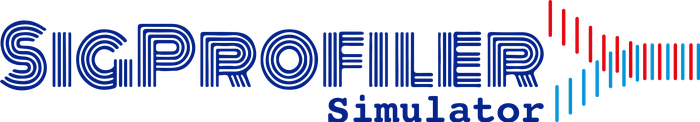

[](https://osf.io/usxjz/wiki/home/)
[](https://opensource.org/licenses/BSD-2-Clause)
[](https://app.travis-ci.com/AlexandrovLab/SigProfilerSimulator)



# SigProfilerSimulator
SigProfilerSimulator allows realistic simulations of mutational signatures in cancer genomes. The tool can simulate signatures of single base substitutions, double base substitutions, and insertions/deletions across the whole genome or user-defined regions. SigProfilerSimulator makes use of [SigProfilerMatrixGenerator](https://github.com/SigProfilerSuite/SigProfilerMatrixGenerator) and [SigProfilerPlotting](https://github.com/SigProfilerSuite/SigProfilerPlotting), seamlessly integrating with other tools in [SigProfilerSuite](https://github.com/SigProfilerSuite).

## Quick Start Guide
### Installation

Install the current stable PyPi version of SigProfilerSimulator:
```
$ pip install SigProfilerSimulator
```

Install your desired reference genome (available reference genomes are listed below):
```python
$ python
from SigProfilerMatrixGenerator import install as genInstall
genInstall.install('GRCh37')
```

### Running

Simulations are performed using the `SigProfilerSimulator` function. Input files (VCF, MAF, or simple text files) must be placed in the `input/` subdirectory of the project folder. Results will be found in the `output/` subdirectory.

```python
from SigProfilerSimulator import SigProfilerSimulator as sigSim
sigSim.SigProfilerSimulator("project", "/path/to/project/", "GRCh37", contexts=["96"], simulations=100)
```

## Reference

Bergstrom EN, Barnes M, Martincorena I, Alexandrov LB. Generating realistic null hypothesis of cancer mutational landscapes using SigProfilerSimulator. *BMC Bioinformatics*. 2020;21(1):438. [https://doi.org/10.1186/s12859-020-03772-3](https://doi.org/10.1186/s12859-020-03772-3)

## Supported Genomes

GRCh38.p12 [GRCh38] (Genome Reference Consortium Human Reference 37), INSDC
Assembly GCA_000001405.27, Dec 2013. Released July 2014. Last updated January 2018. This genome was downloaded from ENSEMBL database version 93.38.

GRCh37.p13 [GRCh37] (Genome Reference Consortium Human Reference 37), INSDC
Assembly GCA_000001405.14, Feb 2009. Released April 2011. Last updated September 2013. This genome was downloaded from ENSEMBL database version 93.37. 

GRCm38.p6 [mm10] (Genome Reference Consortium Mouse Reference 38), INDSDC
Assembly GCA_000001635.8, Jan 2012. Released July 2012. Last updated March 2018. This genome was downloaded from ENSEMBL database version 93.38. 

GRCm37 [mm9] (Release 67, NCBIM37), INDSDC Assembly GCA_000001635.18.
Released Jan 2011. Last updated March 2012. This genome was downloaded from ENSEMBL database version release 67.

rn6 (Rnor_6.0) INSDC Assembly GCA_000001895.4, Jul 2014. Released Jun 2015. Last updated Jan 2017. 
This genome was downloaded from ENSEMBL database version 96.6.

yeast (Saccharomyces cerevisiae S288C; assembly R64-2-1). Released Nov 2014.
